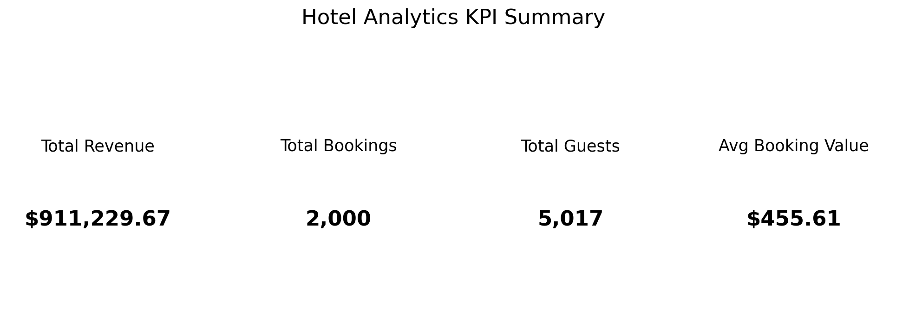
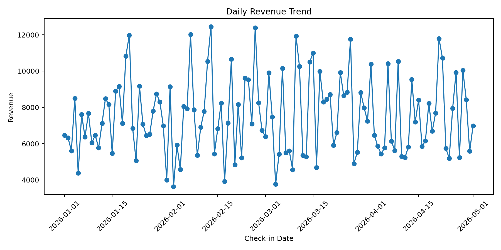
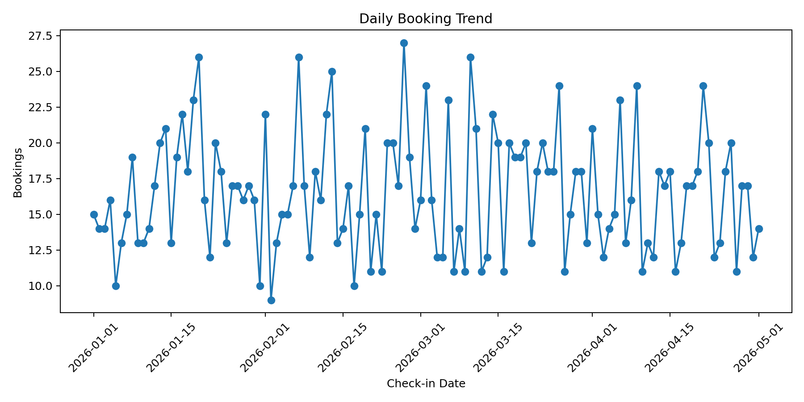
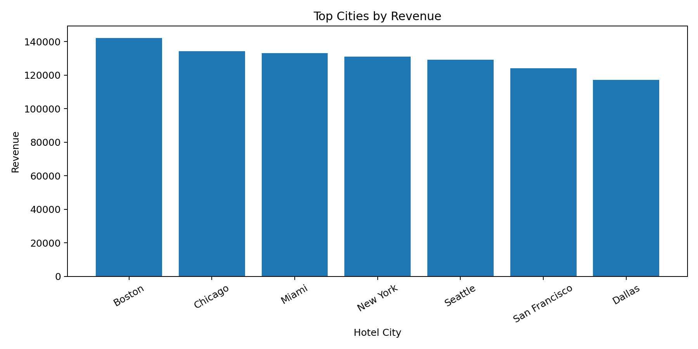
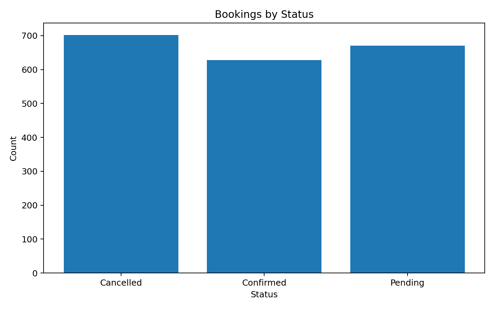
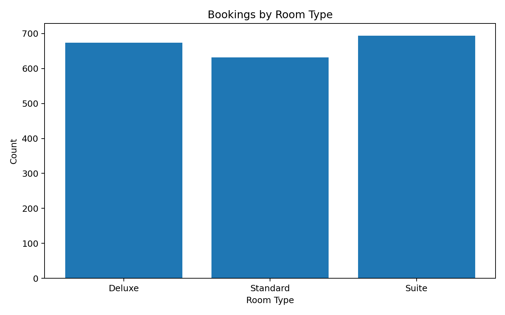

# Hotel Analytics Project (2000 Records)

## Overview
This is a Snowflake data engineering project using a 2000-record dataset.

## Layers
- Bronze: Raw data load
- Silver: Cleaned data
- Gold: Customer summary

## Dataset
Located in `/data/hotel_bookings_2000.csv`

## Steps
1. Upload CSV to Snowflake stage
2. Run SQL scripts in order
3. Build analytics tables

## Output
Customer summary table with:
- total bookings
- total revenue
- avg booking value

## Dashboard Images

### KPI Summary

### Daily Revenue Trend

### Daily Booking Trend

### Top Cities by Revenue

### Bookings by Status

### Bookings by Room Type

